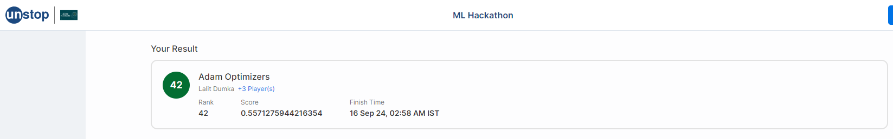

# Amazon ML Challenge 2024

## Team: Adam Optimizers

## Problem Statement

The problem statement is to predict entity value for the given product image and entity type (eg. height, width, weight, etc.).
The dataset contains the following columns:
<!-- image_link,group_id,entity_name,entity_value -->
- image_link: URL of the image
- group_id: ID of the group
- entity_name: Name of the entity
- entity_value: Value of the entity

## Solution

The final approach for our submission includes the use of Florence model. The primary purpose of using this model is Optical Character Recognition. Initially it was decided to fine-tune it on the given dataset but it works fine as it is. As the given dataset does not contain all the text present in the image.

The model is used to extract the text from the image and then the text is processed to extract the entity value. The entity value is then used to predict the entity value for the given entity type.

### Challenges

- The dataset contains a lot of noise.
- The text extracted from the image is not always correct.
- Processing the text to extract the entity value is a challenging task.
- Unit conversion is required for all the entity values.
- Logic to reduce the ambiguity in the entity type. For eg. depth, length and height can be interchanged.

## Results

The model achieved an F1 score of 0.55 on the test dataset.
We were ranked `42nd` on the leaderboard 8 hours before the end of the competition.

In the final standings we are under `Top 80`. The total number of participants were `74,829`.

<!-- image -->

## Team Members

- [Lalit Dumka (me)](https://www.linkedin.com/in/lalit-dumka/)
- [Abhay Gupta](https://www.linkedin.com/in/abhaygupta53/)
- [Kevin Joy Thomas](https://www.linkedin.com/in/kevin-joy-thomas-0aa399271/)
- [Lokesh Joshi](https://www.linkedin.com/in/lokesh-joshi-020019263/)
